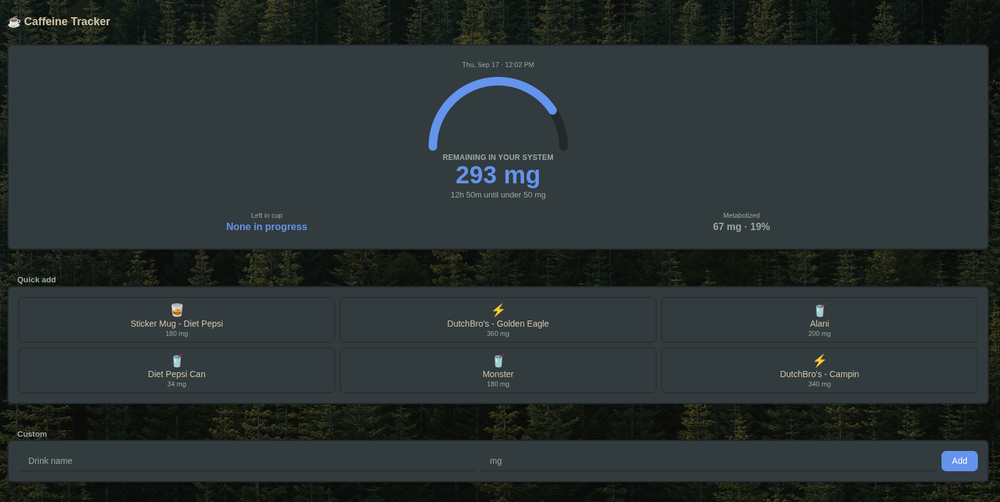
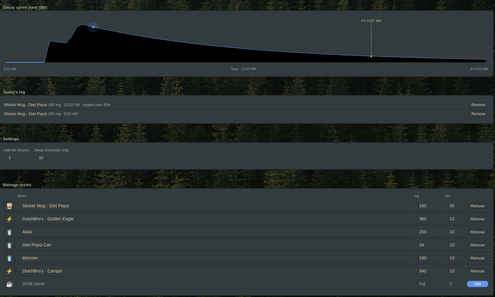
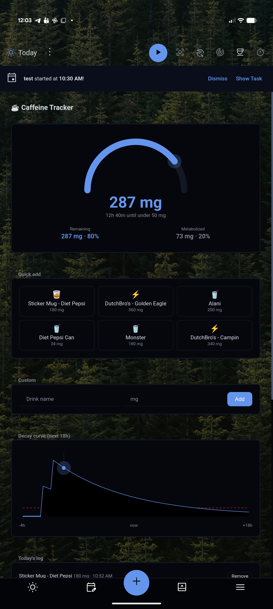

# Caffeine Tracker

A Super Productivity plugin that logs caffeine intake and simulates blood
caffeine level decay using a half-life model.

## Screenshots

  
  

## Features

- Quick-add buttons for common drinks (coffee, espresso, tea, energy drink,
  soda, pre-workout) plus a custom name/mg entry
- Live current caffeine level (mg), recomputed from every logged dose using
  `mg * 0.5^(hoursElapsed / halfLife)`
- Decay curve chart (past 4h to next 18h) with a configurable "sleep
  threshold" line and a countdown to when your level drops below it
- Adjustable half-life (default 5h, the commonly cited average) and
  threshold (default 50mg)
- Today's log with per-entry removal
- Data synced via `persistDataSynced` / `loadSyncedData`, so history follows
  you across devices

## Install

1. Grab a release zip
2. In Super Productivity: **Settings → Plugins → Upload Plugin**
3. Open it from the header button or the menu entry ("Caffeine Tracker")

## Notes

- The half-life model is a simplification for personal tracking, not medical
  advice — individual caffeine metabolism varies (genetics, pregnancy,
  medication, liver function).
- Entries older than 7 days are pruned automatically on load; the decay
  simulation only needs recent doses since older ones contribute a
  negligible amount at a 5h half-life.
