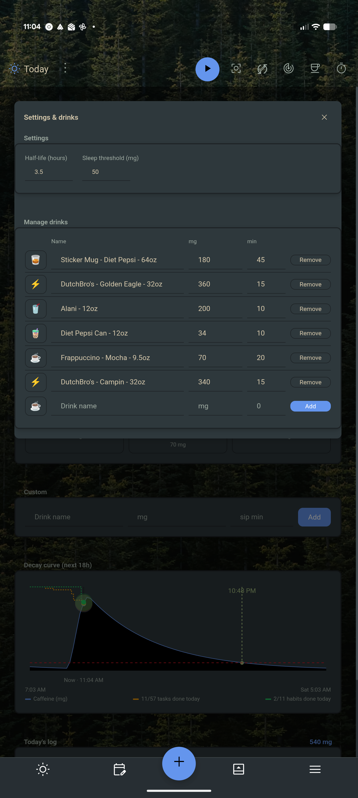
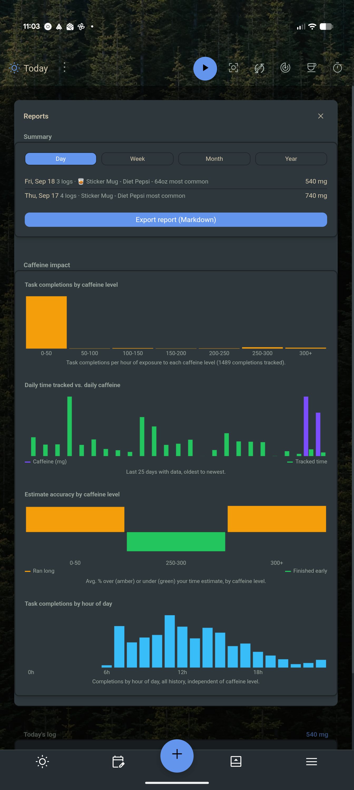

  # Caffeine Tracker

A Super Productivity plugin that logs caffeine intake and simulates blood
caffeine level decay using a half-life model, and its effects on productivity throughout the day.

## Screenshots

  
  

  
  
  

## Features

- Sleep Streak shows consecutive days you stayed under your sleep threshold
- Reporting with export to markdown includes mermaid charts to show graphing
  data, including a combined decay-curve chart (caffeine plus task/habit
  remaining-lines, scaled onto the same axis) over the same window as the
  on-screen chart, and a Sleep log table
- Quick-add buttons for common drinks (coffee, espresso, tea, energy drink,
  soda, pre-workout) plus a custom name/mg entry
- Live current caffeine level (mg), recomputed from every logged dose using
  `mg * 0.5^(hoursElapsed / halfLife)`
- Decay curve chart (past 4h to next 18h) with task burndown, habit tracking, today's sleep total, and today's metabolized mg vs caffeine in your system
- Caffeine impact reports: task completions by caffeine level and by hour,
  estimate accuracy, most-worked tag by caffeine level, and daily habit/time
  correlations
- Sleep tracking: log a duration (hrs/min) and a 0-5 star rating; entries
  logged the same day add up into one running daily total, shown with its
  date in the Sleep log (with per-entry removal), and shaded on the
  daily-breakdown decay panels
- Daily breakdown: a full 00:00–24:00 decay/task/habit panel per day, for a
  configurable number of past days (default 7), each labeled with that
  day's mg total, tasks completed/% scheduled, and habits completed/total
- Adjustable half-life (default 5h, the commonly cited average), threshold
  (default 50mg), daily-breakdown window, and the decay chart's hours-before/
  hours-after window (default 4h/18h)
- Today's log with per-entry removal
- Data synced via `persistDataSynced` / `loadSyncedData`, so history follows
  you across devices
- Update check on open: a 🔔 button appears next to Reports when a newer
  GitHub release exists, linking straight to it

## Install

1. Grab a release zip
2. In Super Productivity: **Settings → Plugins → Upload Plugin**
3. Open it from the ☕ header button

## Notes

- The half-life model is a simplification for personal tracking, not medical
  advice — individual caffeine metabolism varies (genetics, pregnancy,
  medication, liver function).
- Caffeine entries and sleep log entries older than 400 days are pruned
  automatically on load.
- **Network access:** the only outbound call this plugin makes is a single
  read-only `GET` to `api.github.com/repos/BigWebstas/sp-caffiene-tracker/releases/latest`
  once per open, to check for a newer version. Nothing is sent besides the
  request itself — no telemetry, no data upload. This is what the `http`
  permission and `allowedHosts` entry in `manifest.json` are for.
- **Habit timing is approximate, not session-only:** Super Productivity's
  plugin API doesn't expose *when* a habit was checked off, only "what's true
  right now." The habit burndown line works around this by stamping each
  habit with the moment the plugin first sees it done that day, then
  persisting that stamp (it survives closing/reopening the plugin, syncs
  across devices, and rolls into a per-day history for the daily-breakdown
  panels) — so anything already done before you opened the plugin that day
  still lands at open-time rather than the real moment it happened. A day's
  habit line only exists from the day this feature shipped onward; there's no
  way to backfill days before that. Everything else (caffeine log, sleep log,
  tasks, estimate accuracy, hour-of-day, tag breakdown) uses real timestamps
  and isn't affected by this limitation.
